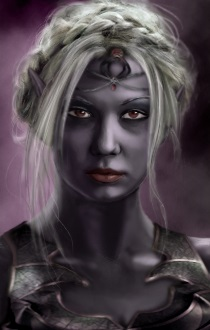

<html>

<b>Xulaye</b>

<b>NPC mod for BG2EE and EET</b>

Original mod by Riviera & Bookwyrme  
Xulaye Despana - sister to the insidious Phaere and daughter of the fearsome Matron Mother Ardulace. Will you help her in her ascent to power? Betray her? Attempt to turn the woman from her dark ways?

- Xulaye joins your party at the beginning of the Ust Natha section of the Underdark. 
- A new quest for the Underdark if you have Xulaye in the party
- Interjections throughout the Underdark
- Scenery dialogue throughout the Underdark
- A possible new ending for the Underdark

  
  

 
&nbsp;

&nbsp;

</body>

</html>

